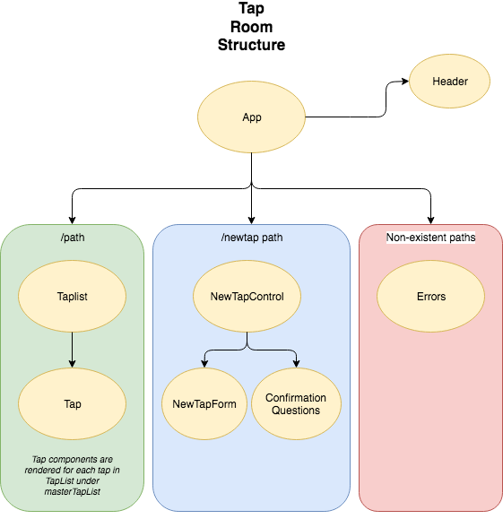

# _Tap Room -- Two Week - React Independent Project One_

 The first independent project for the React course for the coding school, Epicodus, written on September 6th, 2019.

#### By _**Daniel Hongel**_

## Description

This application is an two-week independent project from a React coding class at Epicodus. This application is intended to demonstrate an understanding of React, a JavaScript library. This is beerlist webpage for a mock taproom, called Tap the Sky. 

## Setup/Installation Requirements

* These instructions are aimed for MacOS, and may require slight adjustments if using another OS
* Clone this repository
* Open terminal and type $ `git clone [git link]`
* Navigate to project directory by entering $`cd [project_name]` in terminal
* Open project in text editor (atom)
* In terminal window, type $ `webpack`
* Then enter $ `npm run start`
* Open your favorite browser and navigate to `localhost:8080`

## Route Layout

Changes from Previous Image Version:

* 9-13-19: Tap Control and confirmation questions removed due to being unnecessary 

## Known Bugs

No known bugs

## Support and contact details

Please contact me if you encounter issues with this program, have suggestions, or would like to contribute to this or future projects. I can be reached at:  fatherofdharma@gmail.com.

## Technologies Used

* JavaScript
* HTML5
* CSS
* React
* Webpack
* Atom
* GitHub

### License
_This software is licensed under MIT license._

Copyright (c) 2019 **_Daniel Hongel_**
