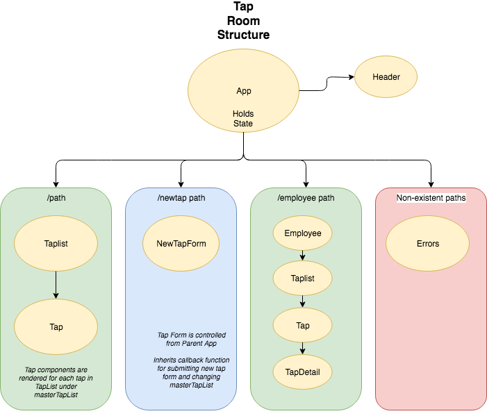

# _Tap Room -- Two Week - React Independent Project One_

 The first independent project for the React course for the coding school, Epicodus, written on September 6th, 2019.

#### By _**Daniel Hongel**_

## Description

This application is an independent coding project from a Ruby coding class at Epicodus. This application is intended to demonstrate an understanding of Ruby and the Rails framework. This an API for an animal shelter, which returns information regarding animals in their database.

## Setup/Installation Requirements

* _These instructions are aimed for MacOS, and may require slight adjustments if using another OS_
* _Clone this repository_
* _Open terminal and type **git clone [git link]**_
* _Navigate to project directory using **cd** in terminal_
* _Open project in text editor (atom)_

## Route Layout

## Known Bugs

No known bugs

## Support and contact details

Please contact me if you encounter issues with this program, have suggestions, or would like to contribute to this or future projects. I can be reached at:  fatherofdharma@gmail.com.

## Technologies Used

* JavaScript
* HTML5
* CSS
* React
* Webpack
* Atom
* GitHub

### License
_This software is licensed under MIT license._

Copyright (c) 2019 **_Daniel Hongel_**
